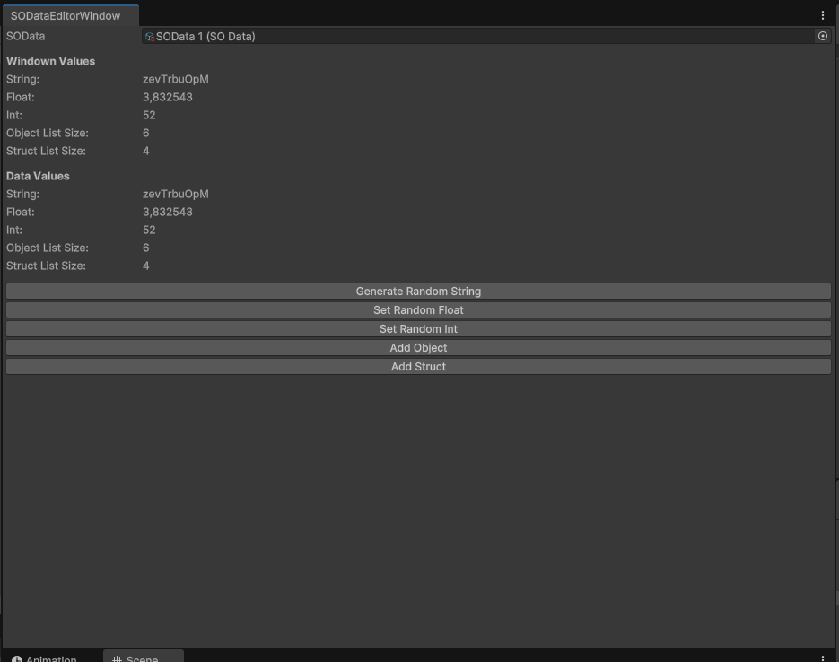

# SOMemoryTest
SOMemoryTest is a Unity project developed to test whether private fields, without [SerializeField], on ScriptableObjects (SOs) retain their data beyond runtime, including when not selected or actively viewed in the Unity Editor.

# Results
The data remains intact, even when the ScriptableObject is not selected in the Unity Editor.

# 🔍 Methodology
1. Created and assigned values to SO1's private fields.
 

2. Switched to a different ScriptableObject (SO2) and assigned different values to SO2.
 

3. Switched back to SO1 and verified that the original values were still intact.
 
   
# Observations
When Unity is closed and reopened, the values of the ScriptableObjects reset.
